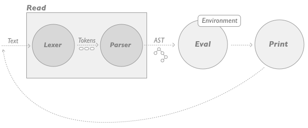

# Functional-Programming-Notes

Нигаматуллин Степан, Марк Ефремов P3334. 

Конспект лекции по функциональному программированию - Динамическая верификация

## Валидация. Верификация - основные понятия
Марк

## Подходы к верификации - основные понятия
Марк

## Динамическая верификация - виды (основные понятия)
Марк

## REPL - READ EVAL PRINT LOOP

Ручное динамическое тестирование — это метод, при котором тестировщик вручную проверяет функционал приложения по заранее определённому техническому заданию.

REPL - это один из видов ручного динамического тестирования основанный на подходе:

ПРОЧИТАТЬ -> ВЫПОЛНИТЬ КОМАНДУ -> ВЫВЕСТИ РЕЗУЛЬТАТ -> ПОВТОРИТЬ



REPL, в своей минимальной реализации есть, наверное, почти у языков с инетрпретируемой средой, таких как: Haskell, Clojure, SmallTalk, Common Lisp, Erlang, и, например, Python.

У всех приведенных выше языков программирования существует REPL, однако все они очень сильно различаются его фукнциональностью, так, например, REPL Python и Haskell мало подходят, чтобы осуществлять полноценное тестирование. Зададимся вопросом: почему?

С одном стороны у этих языков существует свой собственный Debugger, работающий по принципу:
Напиши код -> поставь точку останова -> запусти приложение -> посмотри на ошибку -> закончи процесс дебага -> перепиши программу

Debug позволяет определить ошибку, но не предоставляет возможности ее исправить, этим страдает и REPL Python, как показано на примере:

```python
>>> def devide(a: int, b: int): return a / b
... 
>>> def devide(a: int, b: int):
...     return a / b
... 
>>> devide(1, 2)
0.5
>>> devide(1, 0)
Traceback (most recent call last):
  File "<python-input-4>", line 1, in <module>
    devide(1, 0)
    ~~~~~~^^^^^^
  File "<python-input-2>", line 2, in devide
    return a / b
           ~~^~~
ZeroDivisionError: division by zero
```

Предположим, что мы определили функцию деления и идем по сценарию ручного тестирования: сначала делим 1 на 2, затем 1 на 0.
REPL не предоставляет ничего более, чем stack trace вызова, показывающий, где произошла ошибка. Данный метод конечно можно назвать ручным тестированием, потому что мы все же определили, почему возникает ошибка, однако по сравнению с другими REPL, данный подход очень слаб.

Подобной проблемой страдает и GHCI Haskell'a, заметим лишь, что благодаря свой системе типов, Haskell прямо в REPL предоставляет нам информацию о типах данных функции, что поможет при тестировании: 

```haskell
ghci> let devide a b = div a b
ghci> :i devide
devide :: Integral a => a -> a -> a
        -- Defined at <interactive>:1:5
ghci> devide 5 2
2
ghci> devide 5 0
*** Exception: divide by zero
```
### Определим свойства, которые должен иметь *хороший* REPL:

+ Он должен позволять вручную изменять состояние нашей программ, производя полную инспецию данного состояния  - это условие, говорящее, что хороший REPL должен быть отладчиком.
+ Hot Code Reloading - Пусть во время исполнения программы мы наткнулись на нежелательное выполнение функции или инструкции - REPL должен позволять ***на лету*** изменять реализацию функции или инструкции, при этом:
    1. **Не** теряя текущее состояние процесса 
    2. **Не** останавливая текущий процесс
  
  Это безусловно главное отличие обычного интерпретатора от REPL, потому что второй, вместе того, чтобы прекратить выполнение программы с ошибкой, спрашивает себя: А что мне делать если в функции возникла ошибка? Будем считать, что хороший REPL позволяет пользователю самомстоятельно разрешать подобные ошибки
+ Позволяет ***на лету*** реализовывать программу, таким образом проводя параллель между Редактор кода и его интерпретатором 

Типичным примером хорошего REPL является REPL Small Talk, помимо того, что он реализует свойства Debugger и позволяет на лету реализовывать программу, он еще и предоставляет интерфейс, для исправления ошибок, возниких во время исполнения:
Предположим, что функция ведет себя неправильно, или даже не существует, вместо того, чтобы выкидывать Exception и умирать, SmallTalk (Или Common Lisp), помимо обычных реакций на ошибку (просто выйти из программы), позволит вам доопределить функцию, или подменить ее вызов некоторой друго функцией прямо в Runtime.

//? Пример ?

Erlang так же позволяет довольно хороший интерфейс взаимодействия: Предположим, вы реализуете некоторый сервер. Вы можете запустить его, открыть консоль, привести сервер в состояние, в котором может быть потенциальная ошибка, после чего, на лету патчить его, то есть изменять функциональность сервера на уровне исходного кода.

//? Пример ?

Поведение REPL Clojure схоже c поведением REPL Erlang. Имея некоторый разработанный сервер, вы так же можете подключиться к нему, вызвать поведение, при котором сервер упадет с ошибок, и, например, замкнуть состояние сервера в некоторую глобальную переменную. После этого вы можете изменить исходный код, перезалить его на виртуальную машину, на которой исполняется сервер, и от начала и до конца при помощи дебаггера, пройтись по тестовому сценарию запроса на уже изменненном сервере.

//? Пример ?

### Разработка приложения, с использованием REPL

Стоит отметить, что принцип разработки приложеняи в REPL сильно отличается от привычного многим программистом способа.

Обычно, при разработке приложения, вы реализуете его сверху-вниз, от большего к меньшему - Деклалируете модуль, деклалируете класс, деклалируете его функционал, реализуете его функционал.

В случае с REPL подход должен быть другим - снизу-вверх:
Вы сначала реализуете логику, в виде некоторых функций, тестируете их, потом помещаете их в некоторый деклалированный класс. У этого есть конечно есть некоторый плюс - например, когда вы только объявите класс, весь его функционал уже будет релизован. 

//? Картинка ?

Однако надо мириться и с некоторыми ограничениями, основное из который - это область видимости переменных.

Предположим, используя REPL, вы будете реализовывать классы сверху вниз, таким образом, любая объявленная вами переменная, которая в будущем будет использоваться в нескольких функциях будет глобальной - это чревато тем, что поведение функций будет зависеть друг от друга - такого быть не должно, однако и решается такой вопрос довольно легко, вам просто необходимо реализовывать функционал снизу вверх, таким образом вы:
* Объявляете переменные, которые будут использовать в функции - сейчас они глобальные
* Реализуете функцию
* Далее перед вызовом функции замыкаете переменные, по существу, передавая их скопированные значения в функцию - ура, теперь они локальные.


[Small Talk REPL](https://live.exept.de/doc/online/english/getstart/TOP.html#REPLMODE)
[Clojure REPL](https://clojure.org/guides/repl/introduction)


## Автоматические тесты - виды
Марк

## Unit-tests vs. Integration Tests 
Марк

## Test coverage
Марк

## doctest ? 
Степан

## Golden Master Testing
Степан

## Fuzzy and Monkey Testing
Марк

## Race Condition Detection
Степан

## Property-Based Testing
Степан
