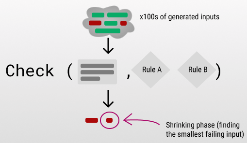

# Functional-Programming-Notes

Нигаматуллин Степан, Марк Ефремов P3334. 

Конспект лекции по функциональному программированию - Динамическая верификация

## Валидация. Верификация - основные понятия

Валидация и верификация - базовые понятия для компьютерных систем.

**Валидация** - проверка системы на соответствие неформализованному запросу стейкхолдеров
Отвечает на вопрос "Have we done the **right thing**?"

**Верификация** - проверка на соответствие спецификации
Отвечает на вопрос: "Have we **done** the thing **right**?"

Таким образом, верификация требует наличия документа с формализованными требованиями, на основе которого будут проводиться проверки.

В лекции приводится пример Большой Берты - орудия времён Первой мировой войны. Эта пушка соответствовала функциональным требованиям: стреляла с огромной разрушительной силой на большие расстояния, однако использовать её было нецелесообразно. Ввиду веса в 41 тонну, она могла перемещаться только по железной дороге, что делало её использование на линии фронта затруднительным. То есть, она успешно проходила верификационные испытания, но не валидационные.

Подробнее:<br>
https://se.ifmo.ru/documents/10180/671657/Лекции+по+ОПИ+v1.3.3.pdf/50ce1e06-00d9-4900-be9c-a3316a746d6d

## Подходы к верификации - основные понятия
Верификация делится на два класса:
- **Динамическая** - осуществляется через эксперимент. Тестирование в привычном понимании этого слова.
- **Статическая** - проверки применяются к артефактам программной системы: код как текст, документация, модели. Запуск программы, и даже само существование готовой системы не требуется.

Эксперимент затрагивает набор конкретных тестовых случаев.
Поэтому он не способен продемонстрировать отсутствие ошибок, лишь выявить их с некоторой вероятностью. 


В то же самое время, статическая верификация позволяет рассуждать о целых категориях вопросов, касательно поведения системы. Проще говоря, проверяет её свойства.

Это даёт больше гарантий корректности, но подобная работа с общим случаем крайне затруднительна и требует ухищрений. 
Например, при проверке всех ветвей исполнения программы, возникает [path explosion](https://en.wikipedia.org/wiki/Path_explosion), с которым необходимо бороться, склеивая ветви и разворачивая циклы.

## Динамическая верификация - виды (основные понятия)
Динамическая верификация классифицируется следующим образом:

По аспекту, на котором тестирование фокусируется:
- **Функциональное** - проверка поведения системы на соответствие ожидаемому
- Нагрузочное - проверка работоспособности системы в условиях критического использования ресурсов
- Стресс-тестирование - проверка возможности восстановления системы. Например, что после сбоя не осталось никаких артефактов.
- Cтабильности, Безопасности, Локализации, Совместимости

По уровню тестирования:
- Модульное - тестирование отдельных компонентов, остальные при этом заменяются mock-моделями.
- Интеграционное - тестирование взаимодействия компонентов
- Системное - тестирование системы как единого целого.

По характеру проведения тестирования:
- Ручное. В данной лекции рассматривается только REPL.
- Автоматизированное

## REPL - READ EVAL PRINT LOOP

REPL - это один из видов ручного динамического тестирования основанный на подходе:

ПРОЧИТАТЬ -> ВЫПОЛНИТЬ КОМАНДУ -> ВЫВЕСТИ РЕЗУЛЬТАТ -> ПОВТОРИТЬ


REPL может быть реализован на основе интерпретатора, поэтому он в том или ином виде есть у следующих языков: Haskell, Clojure, SmallTalk, Common Lisp, Erlang, и, например, Python.

Однако REPL'ы приведенных выше языков сильно отличаются функциональностью, так, например, REPL Python и Haskell мало подходят, чтобы осуществлять полноценное тестирование:

У этих языков существует свой собственный Debugger, работающий по принципу:
Напиши код -> поставь точку останова -> запусти приложение -> посмотри на ошибку -> закончи процесс дебага -> перепиши программу

Debug позволяет определить ошибку, но не предоставляет возможности ее исправить, этим страдает и REPL Python, как показано на примере:

```python
>>> def devide(a: int, b: int):
...     return a / b
... 
>>> devide(1, 2)
0.5
>>> devide(1, 0)
Traceback (most recent call last):
  File "<python-input-4>", line 1, in <module>
    devide(1, 0)
    ~~~~~~^^^^^^
  File "<python-input-2>", line 2, in devide
    return a / b
           ~~^~~
ZeroDivisionError: division by zero
```

Предположим, что мы определили функцию деления и идем по сценарию ручного тестирования: сначала делим 1 на 2, затем 1 на 0.
REPL не предоставляет ничего более, чем stack trace вызова, показывающий, где произошла ошибка. Данный метод конечно можно назвать ручным тестированием, потому что мы все же определили, почему возникает ошибка, однако по сравнению с другими REPL, данный подход очень слаб.

Подобной проблемой страдает и GHCI Haskell'a, заметим лишь, что благодаря свой системе типов, Haskell прямо в REPL предоставляет нам информацию о типах данных функции, что поможет при тестировании: 

```haskell
ghci> let devide a b = div a b
ghci> :i devide
devide :: Integral a => a -> a -> a
        -- Defined at <interactive>:1:5
ghci> devide 5 2
2
ghci> devide 5 0
*** Exception: divide by zero
```
### Определим свойства, которые должен иметь *хороший* REPL:

+ Он должен позволять вручную изменять состояние нашей программы, производя его полную инспекцию - это условие означает, что хороший REPL должен также быть и отладчиком.
+ Hot Code Reloading - Пусть во время исполнения программы мы наткнулись на нежелательное выполнение функции или инструкции - REPL должен позволять ***на лету*** изменять реализацию функции или инструкции, при этом:
    1. **Не** теряя текущее состояние процесса 
    2. **Не** останавливая текущий процесс
  
  Это главное отличие обычного интерпретатора от REPL, потому что последний, при возникновении ошибки, в интерактивном режиме предлагает пользователю указать способ её разрешения.
+ Позволяет ***на лету*** реализовывать программу, таким образом проводя параллель между редактором кода и его интерпретатором 

Примером хорошего REPL служит REPL Small Talk.
При возникновении ошибок он допускает следующие способы её обработки:
- Доопределить функцию
- Подменить её вызов другой функцией прямо в Runtime

//? Пример ?

Для Erlang - языка, предназначенного для создания распределённых вычислительных систем, существует REPL для отладки сервера без его отключения: 
Вы можете запустить сервер, открыть консоль, привести сервер в состояние, в котором может быть потенциальная ошибка, после чего, на лету патчить его, то есть изменять функциональность сервера на уровне исходного кода.

//? Пример ?

Поведение REPL Clojure схоже c поведением REPL Erlang. Имея некоторый разработанный сервер, вы так же можете подключиться к нему, вызвать поведение, при котором сервер упадет с ошибок, и, например, замкнуть состояние сервера в некоторую глобальную переменную. После этого вы можете изменить исходный код, перезалить его на виртуальную машину, на которой исполняется сервер, и от начала и до конца при помощи дебаггера, пройтись по тестовому сценарию запроса на уже изменненном сервере.

//? Пример ?

### Разработка приложения, с использованием REPL

Стоит отметить, что принцип разработки приложения в REPL сильно отличается от привычного многим программистом способа.

Обычно, при разработке приложения, вы реализуете его сверху-вниз, от большего к меньшему - Декларируете модуль, декларируете класс, декларируете его функционал, реализуете его функционал.

В случае с REPL подход должен быть другим - снизу-вверх:
Вы сначала реализуете логику, в виде некоторых функций, тестируете их, потом помещаете их в некоторый декларированный класс. У этого есть конечно есть некоторый плюс - например, когда вы только объявите класс, весь его функционал уже будет релизован. 

//? Картинка ?

Однако надо мириться и с некоторыми ограничениями, основное из который - это область видимости переменных.

Предположим, используя REPL, вы будете реализовывать классы сверху вниз, таким образом, любая объявленная вами переменная, которая в будущем будет использоваться в нескольких функциях будет глобальной - это чревато тем, что поведение функций будет зависеть друг от друга - такого быть не должно, однако и решается такой вопрос довольно легко, вам просто необходимо реализовывать функционал снизу вверх, таким образом вы:
* Объявляете переменные, которые будут использовать в функции - сейчас они глобальные
* Реализуете функцию
* Далее перед вызовом функции замыкаете переменные, по существу, передавая их скопированные значения в функцию - ура, теперь они локальные.


Прочитать подробнее:
1. [Small Talk REPL](https://live.exept.de/doc/online/english/getstart/TOP.html#REPLMODE)
2. [Clojure REPL](https://clojure.org/guides/repl/introduction)


## Unit-tests vs. Integration Tests 
Данный пример демонстрирует, что необходимо проводить как Unit-тесты, так и Intgration-тесты.
```python
def f1(a, b):
    return a / b

def f2(a, b):
    return a * b

def f1_2(a1, b1, a2, b2):
    return f1(a1, b1), f2(a2, b2)
```
Пусть тип входных аргументов это `signed byte`, числа от −2<sup>7</sup> до 2<sup>7</sup>−1.

Тогда для проверки отдельных компонентов `f1` и `f2` (модульное тестирование), потребуется проверить
- 2<sup>8</sup> + 2<sup>8</sup> = 2<sup>9</sup> комбинаций.

Для полной проверки их взаимодействия `f1_2` (интеграционное тестирование), потребуется проверить
- 2<sup>8+8</sup> = 2<sup>16</sup> комбинаций.

То есть, в интеграционном тестировании ОДЗ представляет собой комбинацию из ОДЗ компонентов. Граничных случаев получается больше, и проверить их сложнее.

При модульном тестировании комбинаций входных аргументов меньше, и добиться высокого покрытия легче. Тем не менее, только им ограничиться не получится, потому что оно не позволяет проверить, корректно ли модули взаимодействуют друг с другом.

Таким образом, эти тесты решают разные задачи, и их нужно комбинировать, а не использовать по-отдельности.

## Test coverage
Метрикой качества динамической верификации служит тестовое покрытие. 
Чаще всего, под этим понятием подразумевают процентное соотношение строк кода, которые выполняются во время тестов, к общему объёму.

Однако при подобном способе оценки даже 100% покрытие не гарантирует качественного тестирования.

В приведённом ниже примере, абсолютно все строки функции будут хотя бы единожды выполнены в тестах благодаря первым трём `assert`. Тем не менее, оставшаяся комбинация входных аргументов, `True, True`, приводит к возникновению ошибки.

```python
def f(a: bool, b: bool):
    lst = [1, 2]
    i = 0
    if a: i+=1
    if b: i+=1
    return lst[i]

assert f(False, False)
assert f(False, True)
assert f(True, False)
# here we have full test coverage for fucntion f
# but:
assert f(True, True)
Traceback (most recent call last):
  File "<stdin>", line 1, in <module>
  File "<stdin>", line 6, in f
IndexError: list index out of range
```

Выходом из подобной ситуации служит использование другой метрики - покрытие путей исполнения (path coverage).
В этом случае, в тестах требуется пройти все возможные пути исполнения программы, которые возникают при ветвлении.

Благодаря продвинутым техникам программного анализа, вроде [символьного исполнения](https://en.wikipedia.org/wiki/Symbolic_execution), возможно автоматически найти небольшой набор комбинаций входых аргументов, проверка которого обеспечит 100% path coverage.

Но когда дело касается нетривиальных программ, содержащих вложенные циклы, или циклы, число итераций которых зависит от переменных, проверка всех путей не представляется возможной.

Таким образом, ориентироваться исключительно на подобные метрики не стоит. Вместо этого, следует отдать предпочтение вдумчивому написанию тестов, с опорой на структуру исходного кода и анализ предметной области.

Разумеется, это потребует дополнительных усилий и времени. Однако при некачественном тестировании потери всё равно будут больше, поскольку вносить исправления придётся на более поздних этапах работы. 

Подробнее:<br>
https://www.researchgate.net/publication/276198111_Black_Box_and_White_Box_Testing_Techniques_-_A_Literature_Review

## Doctest

Doctest - еще один вид автоматического тестирования

Суть метода очень проста: давайте к документации нашей функции добавим тесты.
Таким образом, описание функции включает в себя:
1. Текстовое описание
2. Примеры использоваия ***в виде испольняемых тестов***

Пример на языке Python:
```python
def factorial(n):
    """Return the factorial of n,
    an exact integer >= 0.

    >>> [factorial(n) for n in range(6)]
    [1, 1, 2, 6, 24, 120]
    >>> factorial(-1)
    Traceback (most recent call last):
        ...
    ValueError: n must be >= 0
............................................
```
Далее запустим проверку документации нашего файла при помощи утилиты:
```bash
$ python -m doctest -v example.py
Trying:
    [factorial(n) for n in range(6)]
Expecting:
    [1, 1, 2, 6, 24, 120]
ok
```
Данный вид тестирования необходим, чтобы поддерживать документацию в актуальном состоянии.
Предположим, вы написали код с использованием библиотеки lib.py, вы запускаете тесты, но некоторые из них не проходят.
Вы не понимаете на чьей стороне ошибка - либо ошиблись вы, либо документация устарела.

Однако с doctest'ами устаревшие примеры в документации
приводили бы к ошибке при сборке, вынуждая разработчика их обновить.

Прочитать подробнее:
1. [Haskell doctest](https://hackage.haskell.org/package/doctest)
2. [Python doctest](https://docs.python.org/3/library/doctest.html)

## Golden Master Testing

Golden тестирование чем то похоже на Doctest. 
Оно является подвидом регрессионного тестирования: давайте будем сохранять ***золотой*** вариант работы нашей программы, с которым в будущем мы сможем сравнивать последующие, измененные версии программы.

Особенности данного метода:
1. Если вывод программы очень большой, то будет плохо вставлять весь этот код в исходники некоторого unit-теста. Сохраним этот вывода в отдельный файл
2. Он позволяет работать с выводами программы, реализованными в любых форматах. В частности - с выводами, которые люди не могут прочитать. Например бинарниками.


Для работы golden test указываются входные данные и эталонный результат. Конфигурация тестовых случаев обычно задаётся с помощью языков разметки, например, yaml.

Далее будем развивать функциональность нашей програмымы. Во время тестирования, входные данные из голден тестов подадим на измененную программу. Полученный результат сравним с эталонным. Вот, что может произойти дальше:
1.. Выходные данные не совпали:
  1. Если мы уверены, что они должны были совпасть, тогда в нашей программе, с последнего обновления голден теста присутствует ошибка. Поправим ее
  2. Может возникнуть и другая ситуация: эталон стал уже неактуален, тогда как мы уверены, что новая версия программы определенно верна. Тогда просто обновим выходные данные голден теста
2. Выходные данные совпали, это значит, что наша программа до сих пор реализиует функционал эталона


Прочитать подробнее:
1. [Python golden tests](https://pypi.org/project/pytest-golden)
2. [Haskell golden test](https://ro-che.info/articles/2017-12-04-golden-tests) - неплохая статья про реализацию Golden test'oв на Haskell

## Fuzzy and Monkey Testing
Входные данные некоторых систем могут быть крайне вариативны, что вызывает трудности при тестировании.

Взять, например, компилятор. Множество исходных программ, которые он должен обрабатывать, безгранично. Как убедиться в том, что он работает корректно? Какие тестовые случаи рассматривать?

В подобных ситуациях, когда необходимо протестировать большое количество комбинаций чего-либо, применяется **фаззинг**. 

> The term “fuzz” was originally coined by Miller et al. in 1990 to refer to a program that “generates a stream of random characters to be consumed by a target program

В общем смысле этого слова, фаззинг описывает процесс автоматического тестирования программы «мусорными данными». То есть, приоритет отдаётся объёму и разнообразию тестов, а не их точности.

Легче всего использовать фаззинг для penetration testing. В этом случае, в процессе фаззинга входные данные намеренно искажаются. Они слегка «выходят за рамки» значений, ожидаемых программой. При запуске программы на этих искажённых, невалидных данных, проводится проверка, что они были успешно отвергнуты программой в результате внутренних проверок и обработки.

Однако можно тестировать и более сложные свойства. Для этого в фаззерах задают «оракул» - модуль, которые проверяет их соблюдение.

**Generation-based** (или model-based) **фаззеры** генерируют входные данные, основываясь на модели, которую им предоставили. Например, для компилятора generation-based фаззер будет генерировать программы, основываясь на грамматике языка, заданной в форме EBNF (grammar-based input generation). Зачастую фаззеры предоставляют API, благодаря которому тестировщик может задать требуемую модель.


**Mutation-based фаззеры**, не требуют модели входных данных. Вместо этого, они меняют уже готовый набор входных данных. 

Ограничением random testing является то, что сгенерированные данные лишь с небольшим шансом затронут интересующие нас области программы, поскольку они могут 
быть отвергнуты в результате внутренних проверок. 

Без дополнительного анализа, сложно определить требуемую структуру входных данных. Например, как сгенерировать с нуля валидный mp3-файл? Здесь можно обратиться к принципу локальности – если входные данные валидные, то, изменив их небольшую часть, мы всё равно с большой вероятностью получим валидные данные.
Таким образом, специфика mutation-based фаззеров заключается в том, что предоставленные примеры входных данных меняются лишь слегка. Например, инвертируются несколько бит. 

Источники:
1. [The Art, Science, and Engineering of Fuzzing:
A Survey](https://arxiv.org/pdf/1812.00140)
2. [A Survey of Modern Compiler Fuzzing](https://arxiv.org/pdf/2306.06884)


**Monkey Testing** – разновидность random testing, которая сильно напоминает фаззинг. Суть заключается в том, что к тестируемой программе применяется последовательность случайных действий, с намерением её сломать.

Можно провести аналогию с обезъяной, которая лазает по тестрируемой системе и беспорядочно жмёт на все кнопки.

Эта техника подходит для распределённых систем. В таком случае, отключаются произвольные куски системы, микросервисы, а затем проверяется её работоспособность.

## Race Condition Detection

Одна из проблем многопоточного программирования - условия гонок - race Condition. 
Если несколько потоков выполняются одновременно, 
мы не можем определить, в каком порядке будут выполнены инструкции на процессоре.

Рассмотрим небольшой пример на языке программирования Go:

```go
func main() {
    i := 0
    go func() {
        i++        // main.go:7
    }()
    fmt.Println(i) // main.go:9
}
```
Здесь функция **func()**, которая увеличивает счетчик **i** на 1, 
вызывается в новом потоке ([Goroutines](https://www.geeksforgeeks.org/goroutines-concurrency-in-golang/)).

Мы не можем точно предугадать, что произойдет раньше: ```i++``` или ```fmt.Println(i)```,
из-за чего результат вывода на экран не определен. Посмотрим на **Race condition detector**, который реализован на языке Go:

Запустим программу с ключом **-race**:
```bash
$ go run -race racy.go
```

И получим следующий результат:
```bash
WARNING: DATA RACE
Write by goroutine 6:
  main.main.func()
      /tmp/main.go:7 +0x44

Previous read by main goroutine:
  main.main()
      /tmp/main.go:9 +0x7e

Goroutine 6 (running) created at:
  main.main()
      /tmp/main.go:8 +0x70
```

Как видите, этот механизм подсказывает нам, что в нашей программе существует **DATA RACE**, 
в данном случае, внутри **main.main.func1()** значение используется с целью **WRITE**, 
то есть изменяется, в то время как в **main.main()** значение используется для **READ**, 
то есть считывается.

Работает данный механизм относительно легко:
* Сначала он проходится по коду и запоминает все ситуации, когда процесс потенциально может повести себя по-разному
из-за диспетчеризации потоков - в данном примере он увидит функцию func, которая запускатеся в другом потоке при помощи ключевого слова go.
* Далее он проходится по всем возможным трассам доступа к данным - то есть по всем путям, в которых в зависимости от диспетчеризации, инструкции чтения или записи данных могут быть поменены местами. Для каждой трассы он рассматирвает порядок чтения-записи данных. Если он находит две трассы, в которых результат выполнения одной и той же функции различается, он дает об этом знать.

Данное решение, конечно, требует больших вычислительных и временных ресурсов для больших программ, однако стоит заметить, 
что более оптимального алгоритма действия на самом деле и нет - нельзя пропускать какую-то трассу работы с данными - 
вдруг именно она окажется такой, где произойдет Race condition - а это значит, что просмотреть нужно все возможные случае -
процесс это не быстрый.

Прочитать подробнее:
1. [Introducing the Go Race Detector](https://go.dev/blog/race-detector)


## Property-Based Testing

Property-Based Testing развился из идей Fuzzy/Monkey Testing. Как можно понять из названия - это тесты, основанные на
свойствах объектов, функций или структур данных. Идея следующая: вместо того, чтобы формально доказать свойство системы, 
мы экспеременатльно убедимся в нем на большем сете тестов.

Предположим, вы написали некоторую функцию, тогда вы можете сформулировать для данной функции свойства - то есть некоторые
утверждения, которые в широком смысле слова описывают её поведение. Примеры свойств:

1. **Коммутативность сложения чисел**:\
  Пусть функция ```add(x, y)``` возвращает сумму двух, поданных на вход чисел, тогда одно из свойств, которое точно должно быть выполнено для корректного сложения - 
  это коммутативность, то есть ```add(x, y) == add(y, x)```. 
2. **Свойства [Моноида](https://ru.wikipedia.org/wiki/Моноид)**:\
  Пусть ```<S, *, e>``` - Моноид на множестве S, с заданной бинарной операцией *, и нейтральным элементом = e. Тогда:
    1. ```∀ a, b, c ∈ S: (a * b) * c = a * (b * c)```
    2. ```∀ a ∈ S: a * e = e * a = a```

    Примеры моноидов:
      * ```<str, ++, "">``` - все возможные строки относительно операции конкатенации и пустой строкой в качестве нейтрального элемента.
    Свойства довольно очевидны - в какой бы последовательности вы не складывали строки, вы всегда получите одно и то же.
    Так же, добавление пустой строки к любой другой слева или справа, очевидно, ничего не меняет.
      * ```<set, ∪, ∅>``` - все множества с операцией объединения и пустым множеством в качестве нейтрального элемента.
      Нетрудно убедиться, что свойства моноида выполнены.
3. **Раскраска и балансировка red-black tree**:\
  Прекрасный пример, демонстрируюший зачем тестирование свойств вообще нужно: предположим вы реализуете множество как структуру данных, 
  конечный пользователь не будет знать, как именно ваша реализация будет работать под капотом, однако он знает:
    1. Интерфейс взаимодействия - в множество можно положить элемент, убрать элемент, проверить наличие элемента.
    2. Заявленое время выполнения операция - например, если вы реализуете множество на основе красно-черных деревьев,
    пользователь уверен, что время выполнения операции вставки имеет асимптотику: ```O(log n)```, где n - количество элементов в множестве.\

    Если первое свойство вполне хорошо проверяется обычными юнит тестами, то второе уже не так очевидно. Так, если вы раскрасите вершины красно-черного дерева неправильно
    или неправильно будете производить добавление (то есть так, что свойства этого дерева будут нарушены), асимптотика операции вставки не будет соответствовать ожиданиям пользователя.\
    Воспользуемся Property-base тестингом! Введем [свойства красно черных деревьев](https://ru.wikipedia.org/wiki/Красно-чёрное_дерево), сгенерируем деревья и проверим их.
    Таким образом, мы будем уверены не только в том, что множество поддерживает операции вставки, удаления и поиска, но и в том, что красно-черное дерево лежащее в основе реализации будет сбалансированным.
4. **Эквивалентность исходной и оптимизированный программы**:\
  Пусть мы написали два компилятора, один из которых будет компилировать код без оптимизаций, а второй - с оптимизациями.
  Утвердим свойство - программа, скомпилированная двумя различными компиляторами должна одинаково исполняться - то есть на одни и те же входные данные, 
  она должна выводить одни и те же выходные. Проверка данного свойства обеспечит эквивалентность исходной и оптимизированный программы.

### Этапы Property-Based Testing:

Данное тестирование имеет три основных этапа:

1. Генерация исходных данных
2. Проверка условий
3. Сжатие входных данных в случае нарушения свойств

\


**Генерация** данных должна быть автоматизирована, потому что тестирование должно производиться десятками тысяч тестов.

Рассмотрим **сжатие (shrinking)** входных данных в случае нарушения свойств:\
Пусть мы нашли тест, который ломает нашу программу и пусть в нем содержится, например, массив из 10000 целых чисел. Продебажить этот тест,
или тем более рассмотреть его вручную - непосильная задача.\
Именно поэтому библиотеки property-base testing'a определенным способом сжимают непройденный тест, чтобы система все так же ломалась на нем и чтобы он был как можно меньше. Стоит лишь заметить, что это не всегда возможно.

### Примеры property-base тестов на основе QuickCheck (Haskell)

В данной программе проверяется простое свойства функции ```reverse```, которая переворачивает массив:

```haskell
import Test.QuickCheck
import Data.List (intersperse)

prop_revapp :: [Int] -> [Int] -> Bool
prop_revapp xs ys = reverse (xs ++ ys) == reverse ys ++ reverse xs

main = quickCheck prop_revapp 
```

В данной программе тестируются свойства ```split``` и ```unsplit```:
```haskell
import Test.QuickCheck
import Data.List (intersperse)

split :: Char -> String -> [String]
split c [] = []
split c xs = xs' : if null xs'' then [] else split c (tail xs'')
    where xs' = takeWhile (/=c) xs
          xs''= dropWhile (/=c) xs

unsplit :: Char -> [String] -> String
unsplit c = concat . intersperse [c]

prop_split_inv xs
    = forAll (elements xs) $ \c ->
        unsplit c (split c xs) == xs

main = quickCheck prop_split_inv
```
Запуск тестов реализуется с помощью вызова ```quickCheck```. библиотека QuickCheck автоматические сгенерирует входные данные, протестирует и сожмет входные данные если найдется непроходимый тест.

Во второй программе QuickCheck корректно найдет ошибку:

```bash
*** Failed! Falsified (after 2 tests and 1 shrink):
"a"
'a'
```
Она возникает потому что split и unsplit не совсем корректны:
```haskell
split 'a' "a" = [""]
unsplit 'a' [""] = ""
```

### Достаточно ли Property-base тестинга для проверки всей системы?

Ответ: **нет**

Дело в том, что проверка свойств системы проверяет исключительно ***свойства***, но не ***поведение***, так, свойства могут быть выполнены и у некорректной функции. 

Пример на основе **hypothesis (python)**:

```python
from hypothesis import given
import hypothesis.strategies as st

def bad_add(a, b):
    return 0

@given(st.integers(), st.integers())
def test_ints_are_commutative(x, y):
    assert bad_add(x, y) == bad_add(y, x)
```
Функция ```bad_add``` всегда возвращает 0, хотя должна складывать числа. Однако, как мы можем заметить, свойство коммутативности выполнено:

```add(x, y) = 0 = add(y, x)```

Данное тестирование, конечно, не является полным, необходимо подкреплять property-base тесты unit тестами.

Прочитать подробнее:
1. [Моноид](https://ru.wikipedia.org/wiki/Моноид)
2. [QuickCheck (Haskell)](https://habr.com/ru/companies/typeable/articles/570922/)
